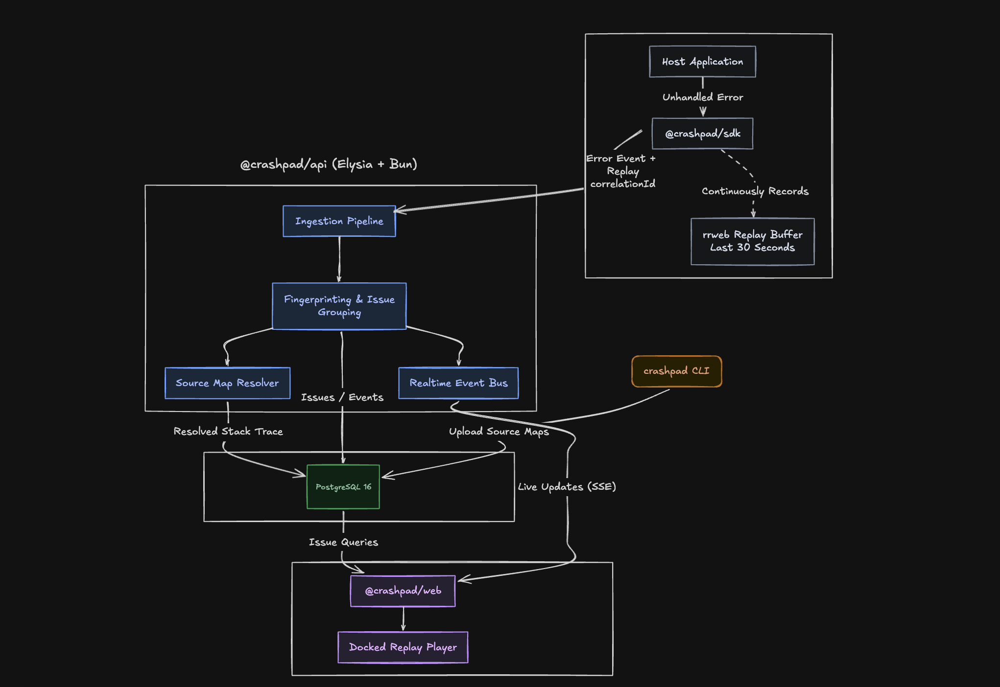

# Crashpad

Frontend error monitoring with a DevTools-style **docked replay player** as the wedge. When an error fires, the SDK flushes the last 30 seconds of the user's session — DOM mutations, clicks, network, console — alongside the stack trace. The dashboard plays that clip back in a time-travel debugger where the **resolved stack trace and the DOM replay scrub together**, so you watch the bug happen instead of guessing from a stack frame.

---

## Quickstart

```bash
# 1. install deps (Bun workspaces)
bun install

# 2. bring up postgres + redis
bun db:up

# 3. copy env + fill in GitHub OAuth secrets
cp .env.example .env
$EDITOR .env

# 4. run migrations
bun db:migrate

# 5. run the api + web in parallel
bun dev
```

Run them individually if you prefer:

```bash
bun dev:api   # Elysia on :4000
bun dev:web   # Next.js on :3000
```

You'll need a [GitHub OAuth App](https://github.com/settings/developers) with its callback URL set to `http://localhost:3000/api/auth/callback/github`. Drop the client ID/secret into `.env`.

---

## How it works

Crashpad is split into three independently-deployable pieces in one Bun monorepo.

### 1. The SDK (`@crashpad/sdk`) — browser only

`Crashpad.init()` installs four capture channels and never throws into the host app (every public entry point is wrapped in `safe()`):

- **Errors** — `window.onerror` + `unhandledrejection`, plus a manual `captureException()`.
- **Replay** — `rrweb` recording into a **30-second circular buffer**, lazily `import()`ed during an idle frame so it never blocks first paint. Inputs are masked by default.
- **Network** — `fetch` / `XHR` timing, status, and failures.
- **Console** — `log` / `info` / `warn` / `error` / `debug`.

When an error fires, the SDK normalizes it, stamps a fresh **`correlationId`**, and sends **two separate payloads**:

| Payload | Endpoint | Why separate |
|---------|----------|--------------|
| **Event** (small) | `POST /api/v1/events` | `fetch` `keepalive` so it survives page-unload |
| **Replay** (large) | `POST /api/v1/replays` | `keepalive` caps bodies at 64 KB; replays exceed that |

Both carry the same `correlationId`. The server joins them on read rather than via a foreign key — this sidesteps the split-payload race where the replay arrives before (or after) the event. Calls to Crashpad's own ingest endpoints are filtered out of the captured session so the SDK never records itself.

### 2. The API (`@crashpad/api`) — Elysia on Bun

On event ingest the server:

1. **Fingerprints** the error — `sha1(errorType | normalizedMessage | topStackFrame)`. The message is normalized (UUIDs, numbers, and quoted strings collapsed to placeholders) and the top frame has its `line:col` stripped, so a shifting minified offset doesn't split one bug into a hundred issues.
2. **Resolves the stack** against uploaded source maps (best-effort, per-frame) — original function/file/line plus ±3 lines of source context.
3. **Upserts the issue** in one transaction: insert-or-bump `eventCount` / `lastSeen`, then insert the event.
4. **Publishes** an `issue:upsert` to the in-process pub/sub, which fans out to any open dashboard SSE stream.

Source maps are uploaded out-of-band via the `crashpad` CLI. Because resolution is best-effort, a **deferred source-map upload re-resolves** any events for that release that came in unresolved.

### 3. The dashboard (`@crashpad/web`) — Next.js 15

App Router, TanStack Query, Zustand, Tailwind v4. Issues stream in **live over SSE** (no polling). Open an issue to get the resolved stack frames, the source-context block, the network/console timeline, and the **docked replay player** scrubbing in lockstep with the error timeline.

---

## Architecture



---

## Project layout

```
crashpad/
├── apps/
│   ├── api/                 # Elysia on Bun — ingest, grouping, resolution, SSE
│   │   └── src/
│   │       ├── routes/      # HTTP surface (events, replays, sourcemaps, issues, projects, stream)
│   │       ├── controllers/ # ingest + fingerprint + query logic
│   │       ├── services/    # source-map resolver
│   │       ├── lib/         # in-process pub/sub
│   │       ├── middleware/  # api-key, auth-guard, cors
│   │       └── db/          # Drizzle schema + migrations
│   └── web/                 # Next.js 15 App Router dashboard
│       └── src/
│           ├── app/         # routes (dashboard, projects, issues)
│           ├── components/  # DockedPlayer, modals, nav
│           ├── queries/     # TanStack Query hooks + SSE stream
│           └── stores/      # Zustand UI state
├── packages/
│   └── sdk/                 # @crashpad/sdk — browser SDK + upload CLI
│       ├── src/core/        # capture, replay, network, console, transport
│       └── cli/upload.mjs   # source-map uploader
├── docker-compose.yml       # Postgres 16 + Redis 7
└── TODOS.md                 # Deferred work (v1.5+)
```

---

## API surface

Ingest endpoints authenticate with a project **API key** (`Authorization: Bearer <key>`); dashboard endpoints use the **GitHub session** cookie.

| Method | Path | Auth | Purpose |
|--------|------|------|---------|
| `GET` | `/health` | — | Liveness + DB probe |
| `POST` | `/api/v1/events` | API key | Ingest an error event |
| `POST` | `/api/v1/replays` | API key | Ingest a session replay |
| `POST` | `/api/v1/sourcemaps` | API key | Upload a source map for a release |
| `GET` | `/api/v1/me` | session | Current user |
| `GET` `POST` | `/api/v1/projects` | session | List / create projects |
| `GET` `PATCH` `DELETE` | `/api/v1/projects/:id` | session | Read / rename / delete project |
| `POST` | `/api/v1/projects/:id/regenerate-key` | session | Rotate API key |
| `GET` | `/api/v1/projects/:id/issues` | session | List issues (search + time filter) |
| `GET` `PATCH` | `/api/v1/issues/:id` | session | Read issue / change status |
| `GET` | `/api/v1/projects/:id/stream` | session | SSE live updates |
| `*` | `/api/auth/*` | — | better-auth (GitHub OAuth) |

---

## Instrumenting an app

```ts
import Crashpad from '@crashpad/sdk';

Crashpad.init({
  apiKey: process.env.NEXT_PUBLIC_CRASHPAD_API_KEY!,
  release: process.env.NEXT_PUBLIC_CRASHPAD_RELEASE, // ties errors to a source-map set
  environment: process.env.NODE_ENV,
  // replay: true,       // default — set false to disable rrweb capture
  // maskInputs: true,   // default — mask text in <input>/<textarea>
});
```

Upload source maps for a release after each production build:

```bash
bunx crashpad upload --dir ./dist --release "$GIT_SHA" --api-key "$CRASHPAD_API_KEY"
```

---

## Tech stack

| Layer | Choice |
|-------|--------|
| API | Elysia.js on Bun |
| Database | PostgreSQL 16 (metadata + events + replays + source maps in one DB) |
| ORM | Drizzle |
| Cache | Redis 7 (rate limiting / dedup — wiring in progress) |
| Real-time | Server-Sent Events over an in-process pub/sub |
| Frontend | Next.js 15 App Router + React 19 + Tailwind v4 |
| Data layer | TanStack Query + Zustand |
| Auth | better-auth, GitHub OAuth only |
| Replay capture | rrweb (lazy import, 30 s circular buffer) |
| Replay playback | custom docked player |
| Source maps | `source-map-js` + `stacktrace-parser`, best-effort per-frame |
| Monorepo | Bun workspaces |
| Testing | bun test + Playwright |

---

## License

TBD (private during v1 dogfooding).
